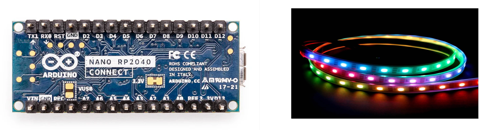

NeoPixelConnect</i>

<i>A WS2812 NeoPixel Library For the Arduino Nano RP2040 Connect</i>

<i>User's Guide</i>

The Arduino Nano RP2040 Connect uses a Raspberry Pi 
RP2040 processor. This processor is comprised of a central 
dual-core Arm Cortex-M0+ processor and two side processors known as
[PIOs](https://tutoduino.fr/en/pio-rp2040-en/). 

NeoPixels require precise timing to support their 
digital communication protocol. Specifically, they operate using an 800 KHz 
data stream, where a specific pulse width represents each bit. 
A "0" bit is represented by a short pulse (200-600ns high, 650ns low),
while a "1" bit is represented by a longer pulse (550-1000ns high, 
450ns low). After transmitting data for all pixels, a longer reset 
pulse (at least 50 microseconds) is needed to latch in the new color values.

Note that timing deviations of more than ±150 ns can cause errors.

The PIO processors provide a means to maintain the precise timing 
required by 
NeoPixel protocol while freeing the central 
dual-core Arm Cortex-M0+ to perform other tasks.

This library implements NeoPixel control based on the 
[pico examples for the WS2812.](https://github.com/raspberrypi/pico-examples/tree/master/pio/ws2812)

